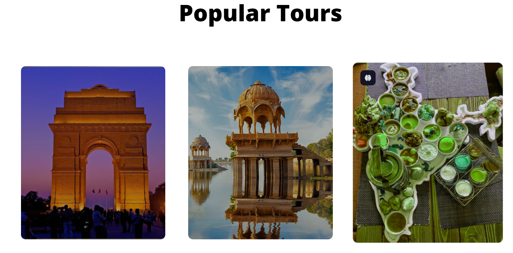
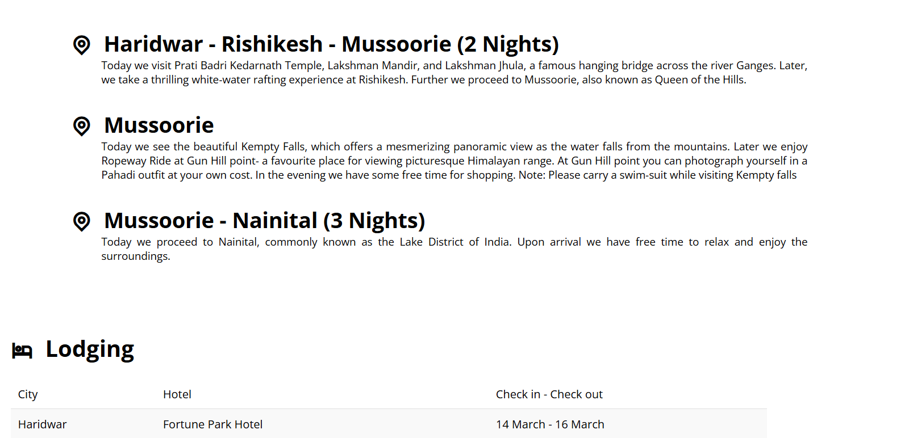
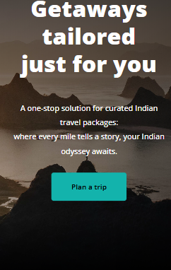
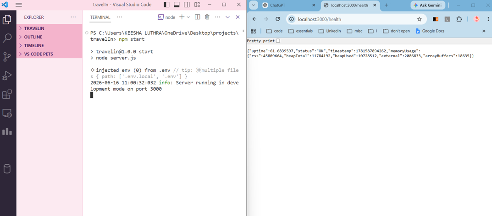

<div align="center">
  

# TravelIN

**A production-ready travel planning platform for discovering curated Indian tour packages.**

[**🚀 View Live Demo**](https://travel-in-seven.vercel.app/)

[](https://nodejs.org)
[](https://expressjs.com/)
[](https://www.docker.com/)
[](LICENSE)
[](https://github.com/keesha-luthra/travelIn/actions)

  <br />


</div>

---

## 🌍 Project Overview

**TravelIN** bridges the gap between scattered travel blogs and fragmented booking sites. It consolidates the discovery of curated Indian destinations—ranging from the serene hills of Dehradun to the cultural heart of Varanasi—into one seamless, performant web experience.

Originally conceptualized as a vanilla static site, TravelIN has been architecturally upgraded into a **production-ready Node.js application**. It now boasts enterprise-grade capabilities, robust security headers, centralized logging, graceful lifecycle management, and an automated CI/CD pipeline.

---

## ✨ Key Features

- 🗺️ **Dynamic Curated Itineraries:** Explore detailed, day-by-day itineraries for top Indian destinations including Kerala, Jaipur, Dehradun, and Prayagraj.
- 📱 **Responsive UI/UX:** A mobile-first, fluid design offering dynamic tour filtering and travel calendars.
- 🚀 **Production-Ready Backend:** A hardened Node.js Express server acting as a secure static file host and health monitor.
- 🛡️ **Enterprise Security:** Hardened with `helmet` for strict CSP headers and `express-rate-limit` for DDoS protection.
- 📊 **Observability:** Centralized, structured JSON logging powered by `winston` and `morgan`.
- ♻️ **Graceful Lifecycle:** Automated connection draining on `SIGTERM`/`SIGINT` and fail-safe environment validation at startup via `envalid`.

---

## 🏗️ Architecture

TravelIN utilizes a robust Node.js middleware architecture serving a lightweight HTML/CSS/JS frontend.

```text
travelIn/
├── .github/workflows/    # CI/CD automation pipelines
├── public/               # Client-side static assets (HTML, CSS, JS, Images)
├── src/                  # Server-side application logic
│   ├── config/           # Environment validation
│   ├── middleware/       # Global error handling
│   ├── routes/           # API endpoints (e.g., /health)
│   └── utils/            # Structured logging
├── server.js             # Express application entry point
└── Dockerfile            # Multi-stage container definitions
```

### Request Flow

`Client` ➡️ `Rate Limiter` ➡️ `Helmet Security` ➡️ `Compression` ➡️ `Static Router` ➡️ `Error Handler`

---

## 📸 Application Gallery

|                                       Home Dashboard                                       |                                       Tour Itinerary                                       |
| :----------------------------------------------------------------------------------------: | :----------------------------------------------------------------------------------------: |
|  |  |

|                                Mobile Responsive View                                |                                 Health API & Logging                                 |
| :----------------------------------------------------------------------------------: | :----------------------------------------------------------------------------------: |
|  |  |

---

## ⚙️ Installation & Local Development

**Prerequisites:** [Node.js](https://nodejs.org/) v18.0+

1. **Clone the repository:**

   ```bash
   git clone https://github.com/keesha-luthra/travelIn.git
   cd travelIn
   ```

2. **Install dependencies:**

   ```bash
   npm install
   ```

3. **Configure your environment** (Optional for local development):

   ```bash
   cp .env.example .env
   ```

4. **Start the development server:**
   ```bash
   npm run dev
   ```

---

## 🔒 Environment Variables

Environment variables are strictly typed and validated at startup using `envalid`. The server will fail fast if required configurations are missing.

| Variable    | Type     | Default       | Description                                   |
| :---------- | :------- | :------------ | :-------------------------------------------- |
| `PORT`      | `number` | `3000`        | The HTTP port the server binds to.            |
| `NODE_ENV`  | `string` | `development` | `development`, `test`, or `production`.       |
| `LOG_LEVEL` | `string` | `info`        | Logging verbosity (`debug`, `info`, `error`). |

---

## 🚀 Deployment

### Docker Support

The repository includes a production-ready, multi-stage `Dockerfile` and `docker-compose.yml` leveraging the lightweight `node:18-alpine` base.

**Test locally with Docker Compose:**

```bash
docker-compose up --build -d
```

The server will be available at `http://localhost:3000`.

### Health Check API

Load balancers and orchestration tools (Kubernetes, AWS ALB) can verify container health via:
`GET /health`

```json
{
  "uptime": 124.53,
  "status": "OK",
  "timestamp": 1718485234000
}
```

---

## 🔮 Future Improvements

While TravelIN is fully production-ready, our roadmap includes:

1. **Dynamic Authentication:** Hooking the existing demo forms into a secure JWT-based authentication service.
2. **Database Integration:** Migrating static HTML itineraries to a managed PostgreSQL database, served dynamically via Express.
3. **Frontend Framework:** Refactoring the vanilla UI into a modern React or Next.js application for state-driven rendering.
4. **Image Optimization:** Setting up an automated WebP conversion pipeline to further improve LCP metrics.

<div align="center">
  <br/>
  <p>Built with ❤️ for travelers everywhere.</p>
</div>
